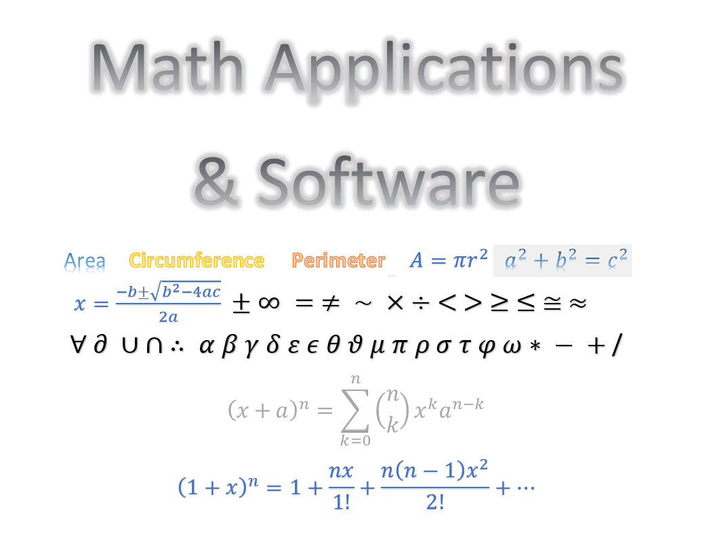

# Math Applications and Software
Description: Calculates Areas, Peritmeter, Circumference, and other formulas.  

## Prerequistes  
Python 3.5+  
Jupyter Notebook Python 3  

## Dependence:  
pyinstaller (pip install pyinstaller)  
tkinker in 3.5 (conda install -c anaconda tk, conda install tk or python -m tkinter)  
numpy 

## Run Programs  
python <...filename...>.py  
Example: python ACP_Apps.py    

Run programs in Python IDLE, Spyder, PyCharms, and etc.  

## Convert File to software or .EXE  
pyinstaller --onefile <...filename...>.py  
Example: pyinstaller --onefile ACP_Apps.py  
When it is successful convert to .EXE, the code will generate the bundle in a subdirectory in "dist" folder.

## Author:  
Tin Hang
