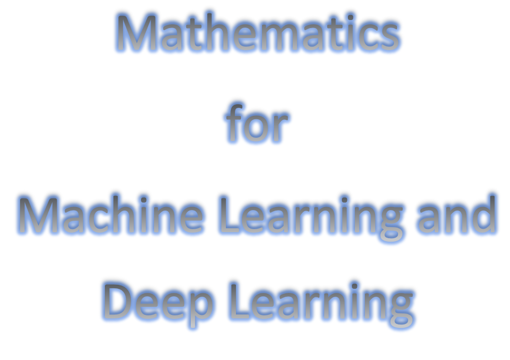
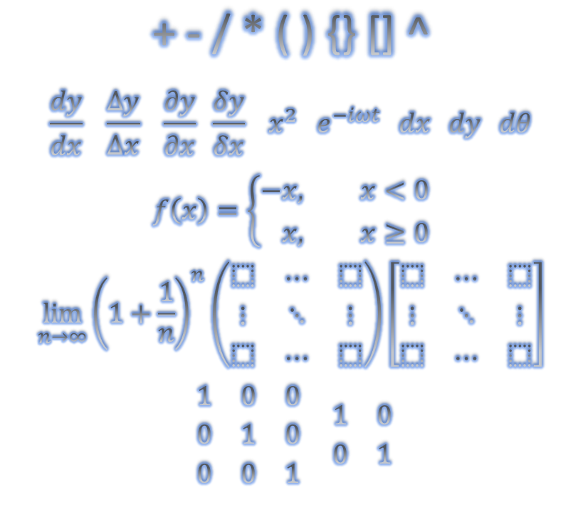

# Mathematics_for_Machine_Learning_and Deep_Learning

This is an examples and tutorials for Mathematics in Machine Learning and Deep Learning.

## Prerequisites
Python 3.0 +

Use jupyter notebook

## List of Mathematics
Basic Mathemathics

Probability

Calculus

Linear Algebra

### Will add more...
